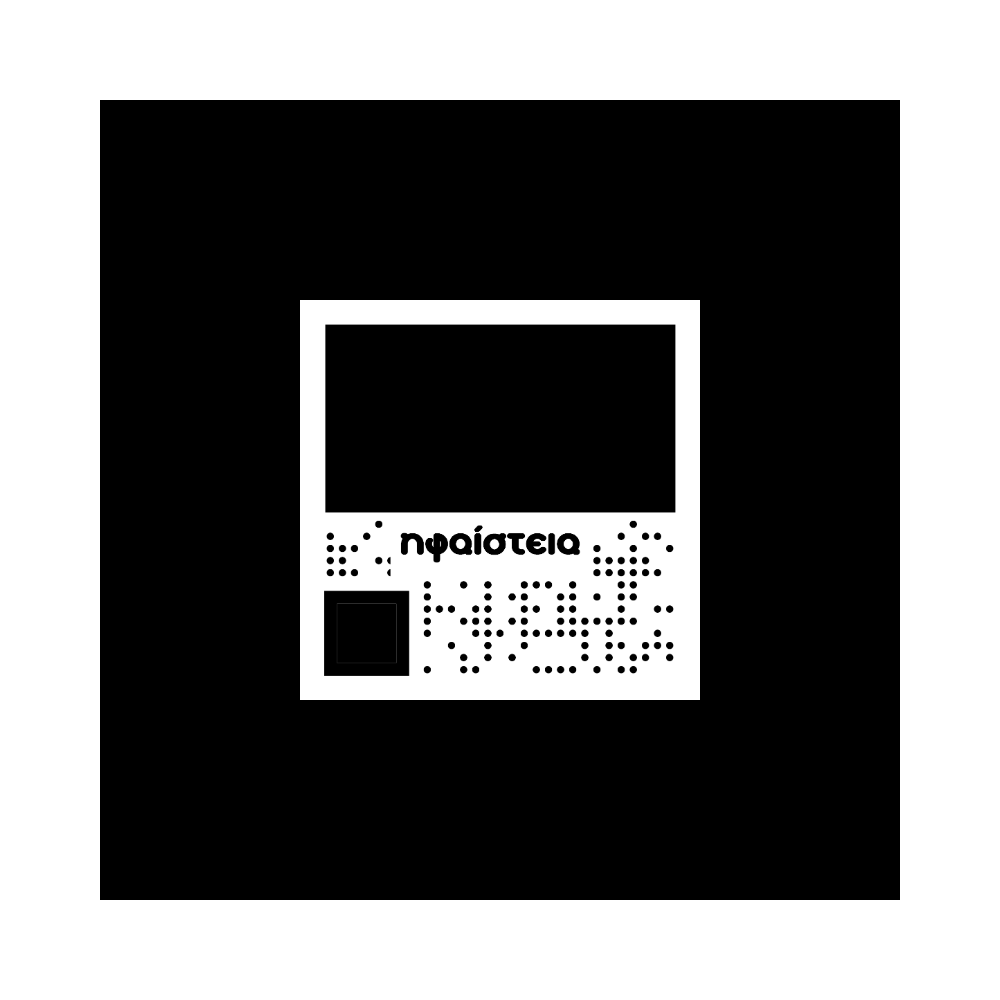

# Αρχεία OER

## Προέλευση Υλικού

Το υλικό που περιέχεται σε αυτό το αποθετήριο προέρχεται από την πλατφόρμα e-me.

## Περιεχόμενα

- [Το αγόρι με την πίτσα.h5p](https://content.e-me.edu.gr/wp-admin/admin-ajax.php?action=h5p_embed&id=1357981)
- [Το ηλιακό μας σύστημα.h5p](https://content.e-me.edu.gr/wp-admin/admin-ajax.php?action=h5p_embed&id=1357606)
- [Χάρτης κρυμμένου πολλαπλασιασμού.h5p](https://content.e-me.edu.gr/wp-admin/admin-ajax.php?action=h5p_embed&id=1357969)
- [Ηφαίστεια.h5p](https://content.e-me.edu.gr/wp-admin/admin-ajax.php?action=h5p_embed&id=1357702) 
- [Τα συναισθήματα του Οδυσσέα στο ταξίδι του.h5p](https://content.e-me.edu.gr/wp-admin/admin-ajax.php?action=h5p_embed&id=1357747)

## QR codes για το OER "Ηφαίστεια"

### QR1

Ο παραπάνω κωδικός QR αναφέρεται στο OER "Ηφαίστεια" και χρησιμοποιείται για να παρέχει γρήγορη πρόσβαση σε περιεχόμενο που σχετίζεται με αυτό το αρχείο H5P- άσκηση Drag Text.

### QR2

Ο παραπάνω κωδικός QR αναφέρεται επίσης στο OER "Ηφαίστεια" και χρησιμοποιείται για να παρέχει γρήγορη πρόσβαση σε περιεχόμενο που σχετίζεται με αυτό το αρχείο H5P- αρχείο τρισδιάστατου μοντέλου.

## Δημιουργός

Το υλικό στο αποθετήριο αυτό δημιουργήθηκε από την Άγγελικη Συροπούλου.

## Άδεια

Το υλικό αυτό διατίθεται υπό την άδεια [Creative Commons Attribution-NonCommercial-ShareAlike 3.0 Greece License (CC BY-NC-SA 3.0 GR)](https://creativecommons.org/licenses/by-nc-sa/3.0/gr/). Ανατρέξτε στο αρχείο LICENSE για περισσότερες πληροφορίες.
